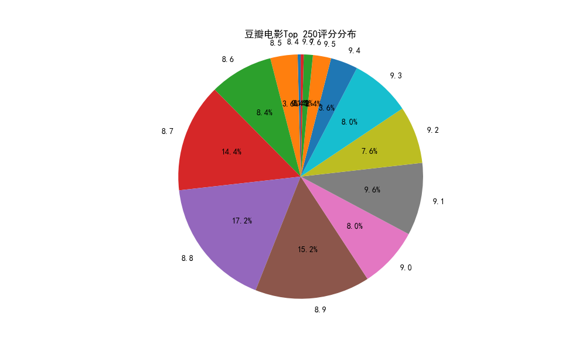

# 豆瓣电影top250爬虫&统计分析

## 目的

使用python爬虫爬取[豆瓣电影top250](https://movie.douban.com/top250?start=)的电影信息，存入excel和csv文件，并使用matplotlib进行作图分析

## 参考程序

```python
# encoding: utf-8
'''
 @author :我不是大佬 
 @contact:2869210303@qq.com
 @wx     ;safeseaa
 @qq     ;2869210303
 @github ;https://github.com/U202142209
 @blog   ;https://blog.csdn.net/V123456789987654 
 @file   :main.py
 @time   :2024/6/27 23:46
  '''
import os
import requests  # 网络请求模块
from lxml import etree  # 数据解析模块
import pandas as pd  # 数据分析模块快
from matplotlib import pyplot as plt

# 支持中文显示
plt.rcParams['font.sans-serif'] = ['SimHei']  # 用来正常显示中文标签
plt.rcParams['axes.unicode_minus'] = False  # 用来正常显示负号

# 全局变量定义
excelFileName = "豆瓣电影top250数据.xlsx"
csvFileName = "豆瓣电影top250数据.csv"

headers = {  # 请求头信息
    'User-Agent':
        'Mozilla/5.0 (Windows NT 10.0; Win64; x64) AppleWebKit/537.36 (KHTML, like Gecko) Chrome/108.0.0.0 Safari/537.36 Edg/108.0.1462.46'
}


# 功能函数，胡哦去列表的而第一个元素
def get_first_text(list):
    try:
        return list[0].strip()  # 返回第一个字符串，除去两端的空格
    except:
        return ""  # 返回空字符串


def check() -> bool:
    """
    判断当前的目录下是否存在目标文件，存在则无需重复爬取
    """
    if os.path.exists(csvFileName) and os.path.exists(excelFileName):
        return True
    else:
        print("已经存在文件:", excelFileName, "无需重复爬取")
        return False


def getMovieData():
    """
    使用爬虫爬取豆瓣电影数据
    """
    df = pd.DataFrame(columns=["序号", "标题", "链接", "导演", "评分", "评价人数", "简介"])

    # 使用列表生成式表示10个页面的地址
    urls = ['https://movie.douban.com/top250?start={}&filter='.format(str(i * 25)) for i in range(10)]
    count = 1  # 用来计数
    for url in urls:
        res = requests.get(url=url, headers=headers)  # 发起请求
        html = etree.HTML(res.text)  # 将返回的文本加工为可以解析的html
        lis = html.xpath('//*[@id="content"]/div/div[1]/ol/li')  # 获取每个电影的li元素
        # 解析数据
        for li in lis:
            title = get_first_text(li.xpath('./div/div[2]/div[1]/a/span[1]/text()'))  # 电影标题
            src = get_first_text(li.xpath('./div/div[2]/div[1]/a/@href'))  # 电影链接
            dictor = get_first_text(li.xpath('./div/div[2]/div[2]/p[1]/text()'))  # 导演
            score = get_first_text(li.xpath('./div/div[2]/div[2]/div/span[2]/text()'))  # 评分
            comment = get_first_text(li.xpath('./div/div[2]/div[2]/div/span[4]/text()'))  # 评价人数
            summary = get_first_text(li.xpath('./div/div[2]/div[2]/p[2]/span/text()'))  # 电影简介
            print(count, title, src, dictor, score, comment, summary)  # 输出

            df.loc[len(df.index)] = [count, title, src, dictor, score, comment, summary]

            count += 1

    df.to_excel(excelFileName, sheet_name="豆瓣电影top250数据", na_rep="")
    df.to_csv(csvFileName)
    print("文件已经生成！")


def datavisualization():
    """
    进行电影数据的简单可视化
    """
    df = pd.read_csv(filepath_or_buffer=csvFileName)
    # 1. 画出所有电影评分的饼形图
    # 计算每个评分的数量（假设评分列名为'评分'）
    rating_counts = df['评分'].value_counts().sort_index()
    # 绘制饼图
    fig, ax = plt.subplots(figsize=(10, 6))
    ax.pie(rating_counts, labels=rating_counts.index, autopct='%1.1f%%', startangle=90)
    ax.axis('equal')  # Equal aspect ratio ensures that pie is drawn as a circle.
    ax.set_title('豆瓣电影Top 250评分分布')
    os.makedirs("images", exist_ok=True)
    plt.savefig('images/豆瓣电影Top 250评分分布.png')
    plt.show()

    # 2. 绘制评价人数的折线图
    # 由于你可能有多个电影具有相同的评分，我们可以选择按序号绘制评价人数的变化
    # 或者，我们可以简单地按评分排序并绘制每个评分的总评价人数

    # 这里我们选择绘制每个评分的总评价人数
    sorted_ratings = rating_counts.sort_index()

    # 绘制折线图
    fig, ax = plt.subplots(figsize=(10, 6))
    ax.plot(sorted_ratings.index, sorted_ratings.values, marker='o')
    ax.set_xlabel('评分')
    ax.set_ylabel('评价人数')
    ax.set_title('豆瓣电影Top 250评价人数随评分变化')
    ax.grid(True)
    plt.savefig('images/豆瓣电影Top 250评价人数随评分变化.png')
    plt.show()


def main():
    if not check():
        getMovieData()
    datavisualization()


if __name__ == '__main__':
    main()
```

## 运行结果




## 获取帮助
视频讲解1:[【python】手把手带你爬虫爬取豆瓣电影top250【超详细教程】https://www.bilibili.com/video/BV1g44y1Z7iZ](https://www.bilibili.com/video/BV1g44y1Z7iZ)

视频讲解2:[【补充】python爬取爬取豆瓣电影数据并储存到excel里面https://www.bilibili.com/video/BV1T8411E7Lx](https://www.bilibili.com/video/BV1T8411E7Lx)

参考博客1:[python爬虫实战代码（一）https://blog.csdn.net/V123456789987654/article/details/130474266](https://blog.csdn.net/V123456789987654/article/details/130474266)

```text
 @author :我不是大佬 
 @contact:2869210303@qq.com
 @wx     ;safeseaa
 @qq     ;2869210303
 @github ;https://github.com/U202142209
 @blog   ;https://blog.csdn.net/V123456789987654 
```
